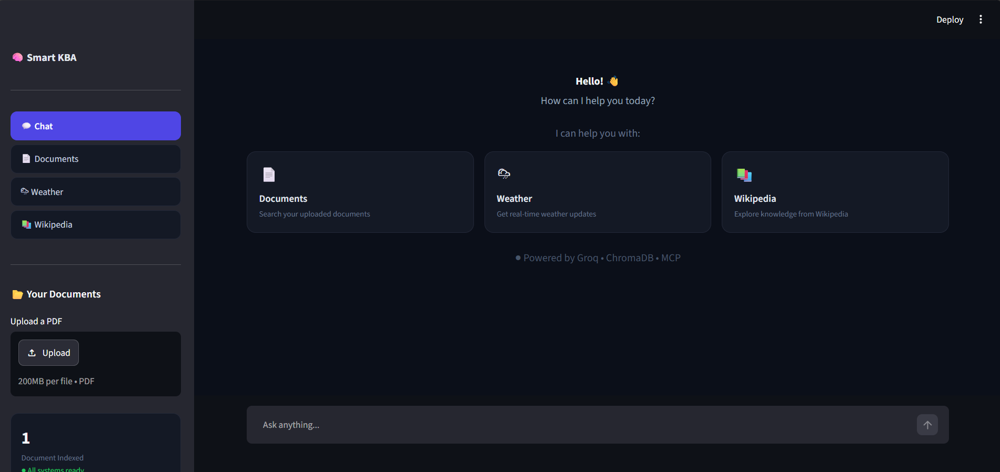
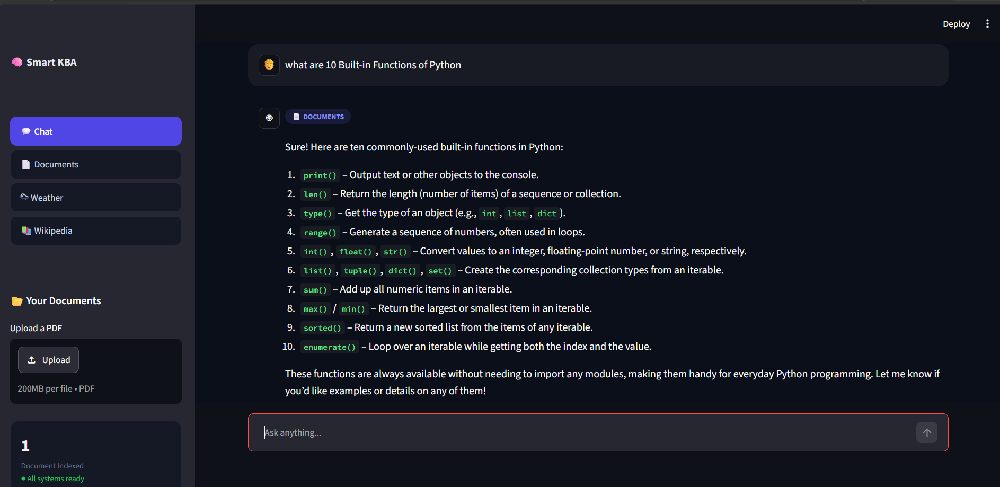
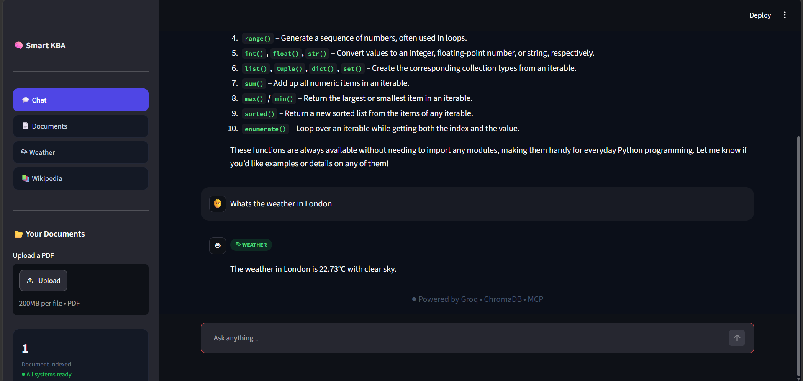
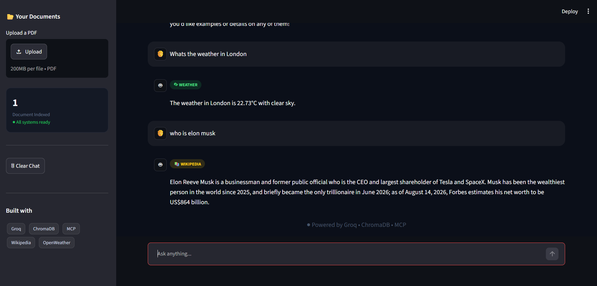

# 🧠 Smart KB Assistant

An AI-powered knowledge assistant built with **Python, Streamlit, Groq, ChromaDB, RAG, and MCP**.

Smart KB Assistant allows users to upload PDF documents and ask questions about their content while also providing real-time weather information and Wikipedia knowledge through external APIs.

## ✨ Features

- 📄 **PDF Knowledge Base** — Upload PDF documents and extract their text.
- 🔍 **RAG-based Question Answering** — Retrieve relevant document chunks using ChromaDB before generating an answer.
- 🤖 **LLM Chat** — Uses Groq-powered LLM inference for natural and conversational responses.
- 🌦️ **Weather Information** — Get current weather information using the OpenWeather API.
- 📚 **Wikipedia Search** — Retrieve summaries from Wikipedia.
- 🔌 **MCP Server** — Exposes document search, weather, and note-saving capabilities as MCP tools.
- 💬 **Interactive Chat UI** — Built with Streamlit with chat history and source-type badges.
- 🔐 **Environment Variables** — API credentials are loaded securely through `.env`.

## 🏗️ How It Works

### Document Question Answering

```text
PDF Upload
    ↓
Text Extraction with PyPDF
    ↓
Text Chunking
    ↓
ChromaDB Vector Search
    ↓
Retrieve Relevant Chunks
    ↓
Groq LLM
    ↓
Generated Answer
````

### Tool-Based Queries

```text
                    Smart KB Assistant
                           │
             ┌─────────────┼─────────────┐
             ↓             ↓             ↓
        Documents       Weather      Wikipedia
             │             │             │
         ChromaDB     OpenWeather API   Wikipedia API
             │
          Groq LLM
```

## 🛠️ Tech Stack

| Technology         | Purpose                         |
| ------------------ | ------------------------------- |
| Python             | Core application logic          |
| Streamlit          | Web interface                   |
| Groq               | LLM inference                   |
| ChromaDB           | Vector database and retrieval   |
| PyPDF              | PDF text extraction             |
| MCP                | Tool-based AI integration       |
| Requests           | External API requests           |
| OpenWeather API    | Real-time weather data          |
| Wikipedia REST API | Knowledge retrieval             |
| python-dotenv      | Environment variable management |

## 📂 Project Structure

```text
smart-kb-assistant/
│
├── app.py                  # Streamlit application
├── chatbot.py              # LLM question-answering logic
├── data_loader.py          # PDF extraction and text chunking
├── vector_db.py            # ChromaDB storage and retrieval
├── mcp_server.py           # MCP server and tools
├── weather.py              # OpenWeather API integration
├── wikipedia_api.py        # Wikipedia API integration
├── requirements.txt        # Python dependencies
├── .gitignore              # Files excluded from Git
│
└── screenshots/
    ├── home.png
    ├── document-question.png
    ├── weather-question.png
    └── wikipedia-question.png
```

## 📸 Screenshots

### Home Interface



### Document Question Answering



### Weather



### Wikipedia



## ⚙️ Installation

### 1. Clone the repository

```bash
git clone https://github.com/AleezahJamil/smart-kb-assistant.git
cd smart-kb-assistant
```

### 2. Create a virtual environment

```bash
python -m venv venv
```

Activate it on Windows:

```bash
venv\Scripts\activate
```

### 3. Install dependencies

```bash
pip install -r requirements.txt
```

### 4. Configure environment variables

Create a `.env` file in the project root:

```text
GROQ_API_KEY=your_groq_api_key
WEATHER_API_KEY=your_openweather_api_key
```

Never commit your `.env` file or expose API keys publicly.

### 5. Run the application

```bash
streamlit run app.py
```

The application will open in your browser.

## 💬 Example Queries

### Documents

```text
What does the uploaded document say about [topic]?
```

### Weather

```text
What is the weather in Lahore?
```

### Wikipedia

```text
Who is Alan Turing?
```

## 🔌 MCP Tools

The MCP server exposes the following tools:

* `search_documents(query)` — Search the knowledge base.
* `get_weather_tool(city)` — Retrieve current weather information.
* `save_note(note)` — Save a note locally.

Run the MCP server with:

```bash
python mcp_server.py
```

## 🚀 Future Improvements

* Persistent ChromaDB storage
* Improved semantic text chunking
* Better query routing between tools
* Conversation memory
* Streaming LLM responses
* Authentication and user-specific knowledge bases
* Improved error handling and API timeouts
* More MCP tools
* Deployment with a production-ready architecture

## 🎯 Project Goal

This project was built to explore practical applications of **LLMs, Retrieval-Augmented Generation (RAG), vector databases, API integration, and Model Context Protocol (MCP)** in an interactive AI application.

## 👩‍💻 Author

**Aleezah Jamil**

BS Computer Science (Artificial Intelligence)

GitHub: [AleezahJamil](https://github.com/AleezahJamil)

```
